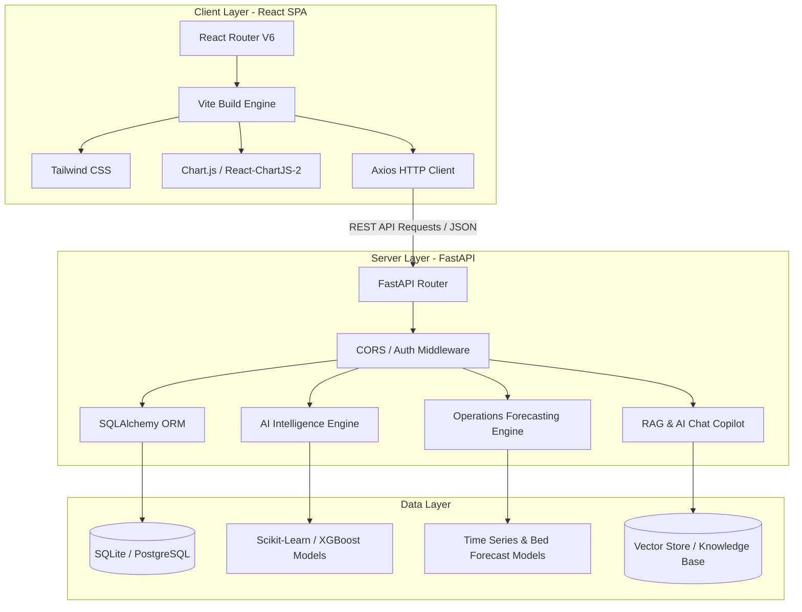
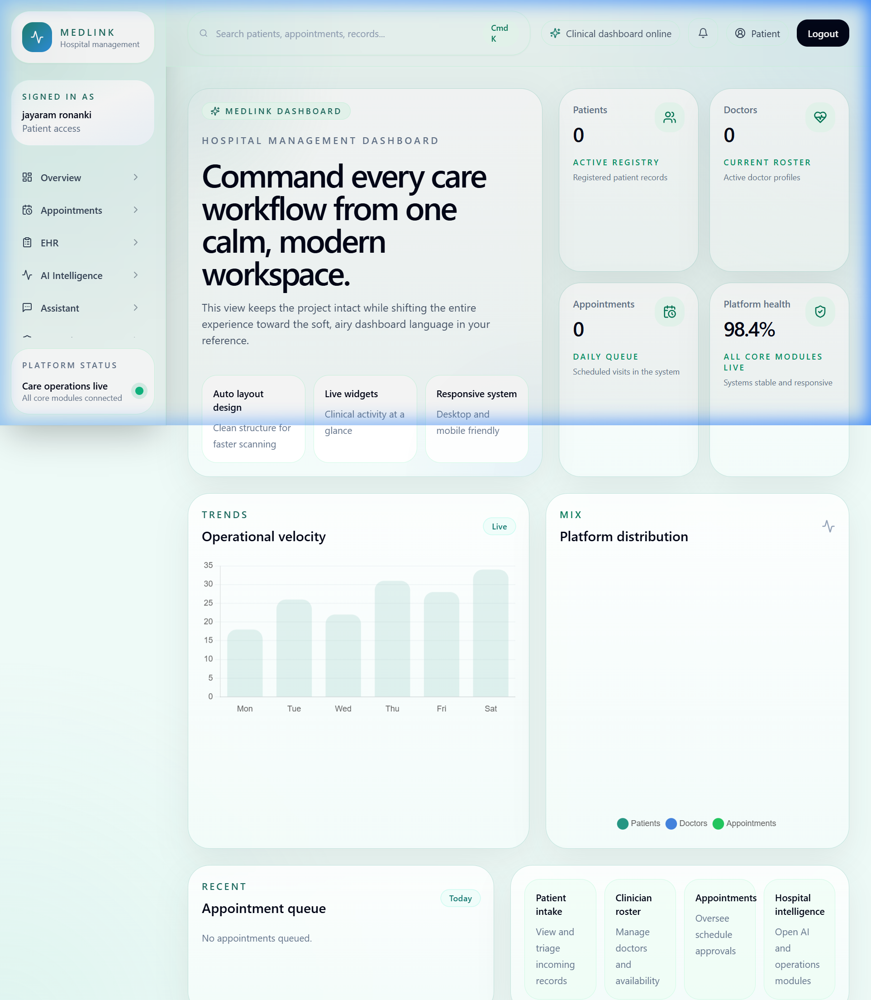
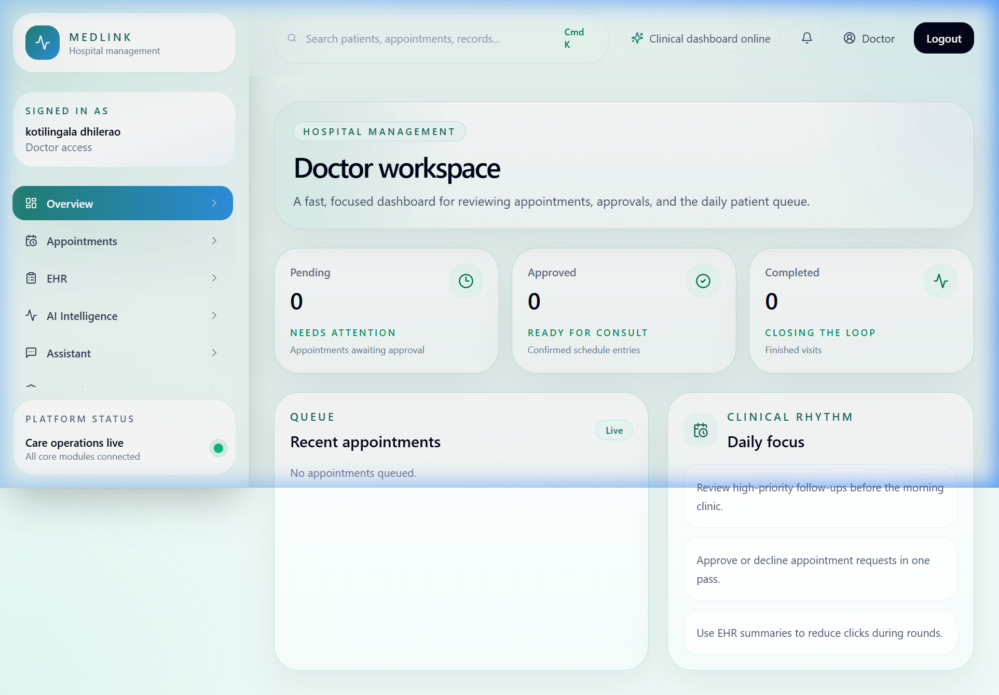
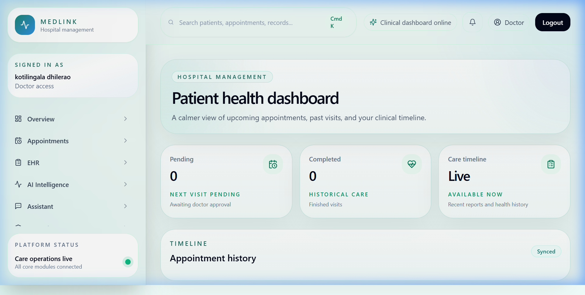
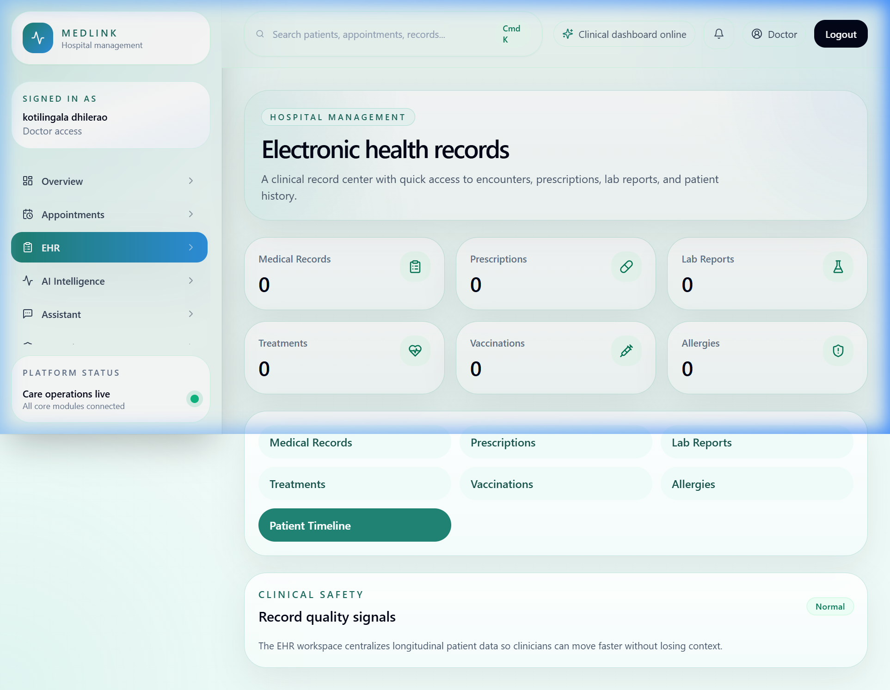
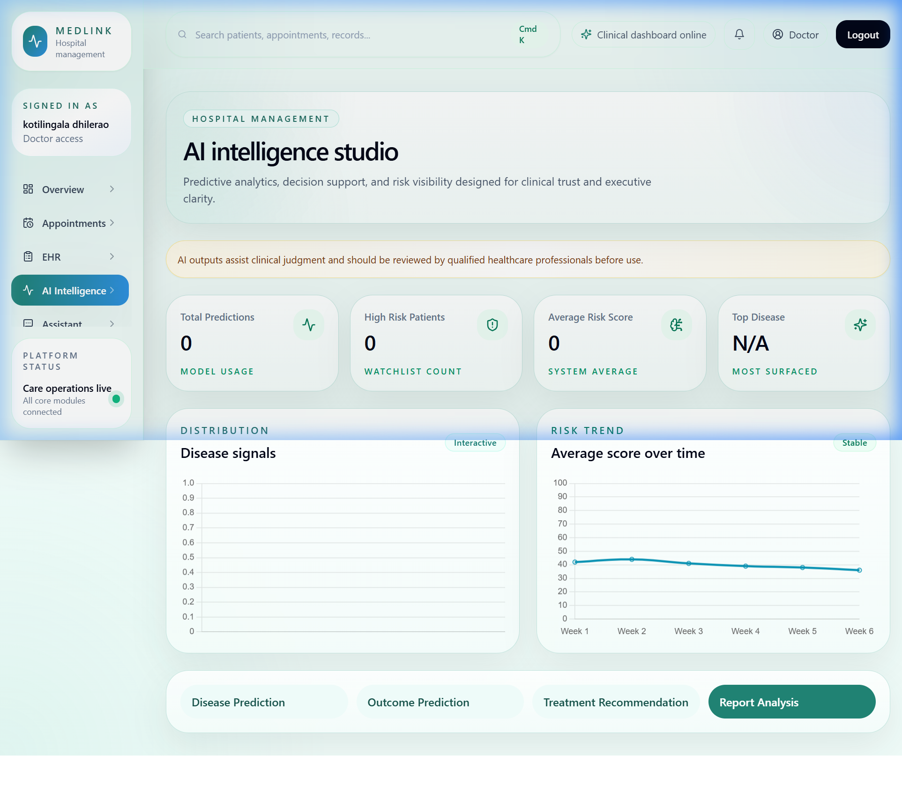
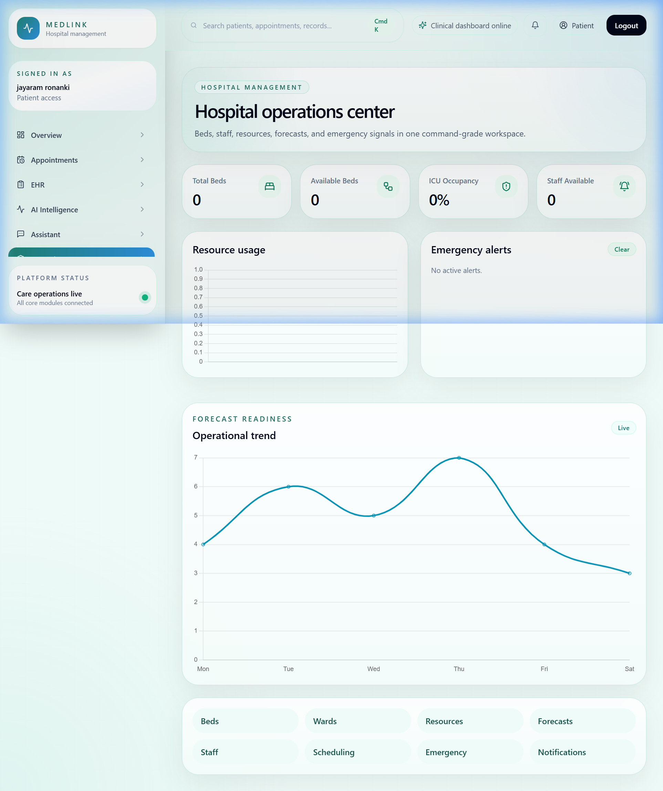
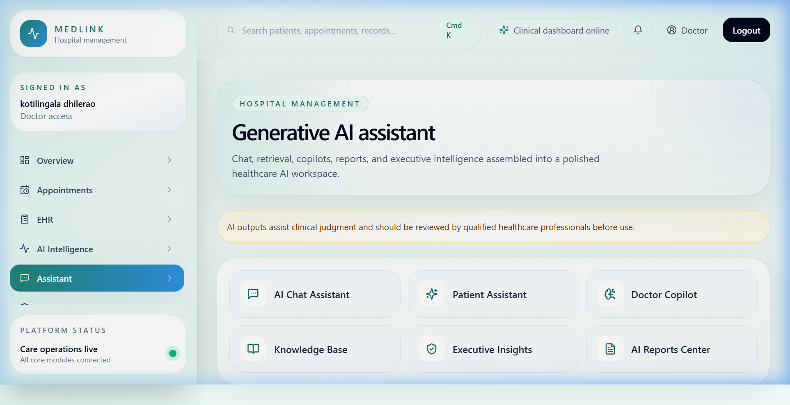

# Medlink HMS: AI-Powered Healthcare Prediction & Resource Management System

[](https://nec-project-10-healthcare-detection-blc9.onrender.com)
[](https://fastapi.tiangolo.com)
[](https://react.dev)
[](https://vitejs.dev)
[](https://tailwindcss.com)

Medlink HMS is a comprehensive, production-grade Hospital Management System integrated with an AI-driven prediction and operations optimization suite. Designed for hospital administrators, doctors, and patients, it combines robust EHR management, interactive AI diagnostic prediction models, automated scheduling, bed/ward tracking, and real-time operations forecasting.

**Live Demo URL**: [https://nec-project-10-healthcare-detection-blc9.onrender.com](https://nec-project-10-healthcare-detection-blc9.onrender.com)

---

## 🏗️ System Architecture



---

## 💻 Core Modules & Dashboards

### 🛡️ Admin Command Center
A unified management console for hospital administrators to oversee active appointments, check user distribution, manage active doctor rosters, view patient intake statistics, and track system health.


### 🩺 Doctor Workspace & Patient Portal
A clinical interface for doctors to manage schedules, log diagnoses, edit prescriptions, view medical histories, and upload lab reports. Patients have their own portal to track appointments, read medical records, check prescriptions, and access lab reports.
*   **Doctor Workspace**:
    
*   **Patient Dashboard**:
    

### 📂 Electronic Health Records (EHR) Suite
A secure records platform providing treatment logs, allergy tracking, vaccination records, historical patient timelines, and downloadable medical report exports.


### 🤖 AI Intelligence Engine
Harnesses machine learning models to perform disease predictions based on symptoms, outcome forecasting, personalized treatment recommendations, and PDF report analysis.


### 📈 Hospital Operations Center
Tracks bed occupancy, forecasts patient influxes using time-series models, monitors resource/equipment inventories, recommends scheduling adjustments, and fires emergency alerts.


### 💬 AI Assistant & Copilots
Interactive chatbots and RAG (Retrieval-Augmented Generation) assistants powered by vector stores to provide medical query resolution, doctor co-piloting, and executive operational insights.


---

## 🛠️ Technology Stack

*   **Frontend**: React (v18), Vite, Tailwind CSS, Lucide React (icons), Chart.js
*   **Backend**: FastAPI, Uvicorn, Python (3.10+), SQLAlchemy
*   **Machine Learning**: Scikit-Learn, NumPy, Pandas, Joblib, XGBoost
*   **Database**: SQLite (local development), PostgreSQL (production-compatible)
*   **Utilities**: PDF Generation (ReportLab)

---

## 📂 Project Structure

```
├── backend/
│   ├── app/
│   │   ├── api/             # API routes and controllers
│   │   ├── core/            # Configuration and security/auth setups
│   │   ├── db/              # SQLAlchemy session initialization and models
│   │   ├── ml/              # Machine learning training pipelines & inference
│   │   ├── forecasting/     # Operations time-series forecasting code
│   │   ├── rag/             # Retrieval-augmented generation for chatbots
│   │   └── main.py          # FastAPI application entrypoint
│   ├── datasets/            # Datasets for model training
│   ├── ml_models/           # Saved ML model binaries (.joblib)
│   ├── forecast_models/     # Saved operational forecast models
│   ├── tests/               # Pytest automated test files
│   └── requirements.txt     # Python backend dependencies
├── frontend/
│   ├── src/
│   │   ├── api/             # Axios API client setups
│   │   ├── components/      # Reusable UI components
│   │   ├── context/         # React Context stores (Auth, Theme)
│   │   ├── pages/           # Module pages (EHR, AI, Operations, Dashboards)
│   │   └── main.jsx         # App bootstrapping
│   ├── package.json         # Node.js dependencies and scripts
│   └── vite.config.js       # Vite build configurations
├── assets/                  # Screenshot assets for documentation
├── render.yaml              # Render blueprint deployment specification
└── README.md                # Project documentation
```

---

## 🚀 Local Development Setup

### Backend Setup

1.  Navigate to the `backend` directory:
    ```bash
    cd backend
    ```
2.  Create and activate a virtual environment:
    ```bash
    # Windows
    python -m venv .venv
    .venv\Scripts\activate

    # macOS/Linux
    python3 -m venv .venv
    source .venv/bin/activate
    ```
3.  Install dependencies:
    ```bash
    pip install -r requirements.txt
    ```
4.  Configure the environment variables:
    ```bash
    copy .env.example .env   # Windows
    cp .env.example .env     # macOS/Linux
    ```
5.  Start the FastAPI server:
    ```bash
    uvicorn app.main:app --reload
    ```
    The backend API docs will be available at [http://localhost:8000/docs](http://localhost:8000/docs).

### Model Training

To train the machine learning models (AI disease prediction and forecasting) from scratch using the local datasets:
```bash
# Execute within the backend directory with virtual environment active:
python -m app.ml.training.train_models
python -m app.forecasting.training.train_forecasts
```

### Frontend Setup

1.  Navigate to the `frontend` directory:
    ```bash
    cd ../frontend
    ```
2.  Install dependencies:
    ```bash
    npm install
    ```
3.  Configure environment variables:
    ```bash
    copy .env.example .env   # Windows
    cp .env.example .env     # macOS/Linux
    ```
4.  Start the development server:
    ```bash
    npm run dev
    ```
    The application will run locally at [http://localhost:5173](http://localhost:5173).

---

## 🧪 Testing

We use `pytest` for backend unit and integration tests. To run all backend tests, run the following command from the `backend` directory (with active `.venv`):
```bash
python -m pytest
```

---

## 🌐 Deployment to Render

This project is pre-configured for automated continuous deployment using Render's Infrastructure-as-Code **Blueprint** specification (`render.yaml`).

### Deployment Steps:
1.  Push your changes to your GitHub or GitLab repository.
2.  Go to the [Render Dashboard](https://dashboard.render.com).
3.  Click **New** (top-right) and select **Blueprint**.
4.  Connect your repository.
5.  Render will automatically parse `render.yaml` and prompt you to create the resources:
    *   **healthcare-hms-backend** (FastAPI Web Service)
    *   **healthcare-hms-frontend** (Static Site with React SPA redirects preconfigured)
6.  Click **Apply** to start building.

### Post-Deployment Configurations:
*   **Database**: By default, the blueprint uses an ephemeral SQLite database (`sqlite:///./hospital.db`) for demonstration purposes. For production, provision a Render PostgreSQL instance and replace the `DATABASE_URL` environment variable on your backend service.
*   **CORS Origins**: If your deployed frontend URL differs from the default `https://healthcare-hms-frontend.onrender.com` (e.g. if a name collision occurred and Render generated a custom suffix), update the `CORS_ORIGINS` env variable on your **Backend Service** to ensure the browser doesn't block API requests.
